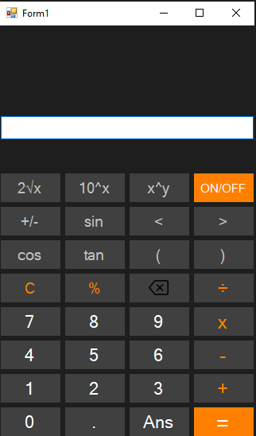

cat << 'EOF' > README.md
# Scientific Calculator - C# .NET Windows Forms App

  
*A fully featured scientific calculator with 15+ operations*

---

## 📋 Features
### Basic Operations
- ➕ Addition, ➖ Subtraction, ✖️ Multiplication, ➗ Division
- % Percentage calculations
- ± Sign change
- . Decimal handling
- C Clear / Clear Entry

### Scientific Operations
- xʸ Power functions  
- √x Square root  
- sin/cos/tan Trigonometric functions  
- ( ) Parentheses precedence  
- Ans (Last answer recall)  

### Special Functions
- 1/x Reciprocal  
- 10ˣ Base-10 exponential  
- ON/OFF simulation  

---

## 🛠️ Installation
```bash
git clone https://github.com/yourusername/scientific-calculator.git
cd scientific-calculator
